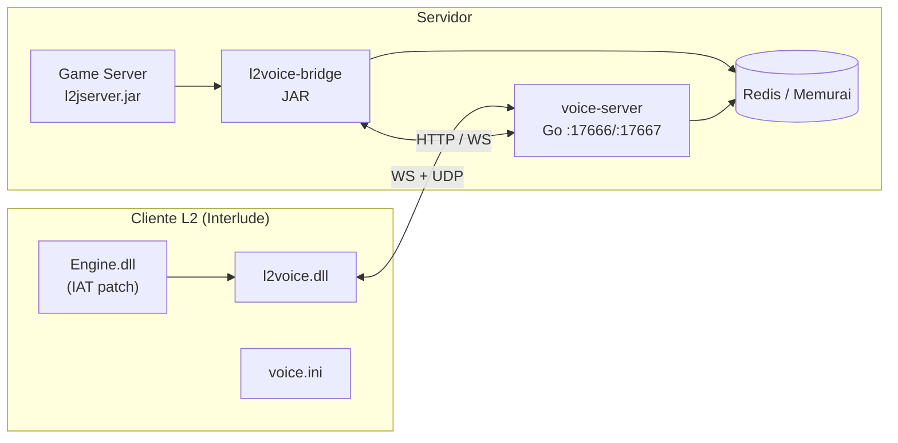

<div align="center">

# L2Voice × L2JALN

### VoIP in-game para Lineage 2 — proximidade, party, clan e ally

**Overlay no cliente · sem browser · sem HTML como interface principal**

<br>

[](LICENSE)
[]()
[]()
[]()
[](https://github.com/luannbr/L2Voice-Chat)
[]()

<br>

[Início rápido](#-início-rápido) ·
[Arquitetura](#-arquitetura) ·
[Cliente Engine.dll](#-cliente-patch-no-enginedll) ·
[Créditos](#-créditos) ·
[Docs PT-BR](README.pt-BR.md)

</div>

---

## Sobre

**L2Voice** traz chat de voz **dentro do jogo**: ícone de microfone, ping, painel `l2voice [connected]` e canais por distância e grupo.

Este repositório é uma **adaptação gratuita** do material **L2Voice-Chat** ([**DwBryel**](https://github.com/luannbr/L2Voice-Chat)), originalmente voltado ao **Lineage II Essence** (pack **Samurai**), integrada no fork **L2JALN aCis 382** (**Interlude**, `net.sf.l2j`).

> Não é o repositório oficial do DwBryel — é um fork comunitário com **créditos preservados**. Ver [CREDITS.md](CREDITS.md).

---

## Destaques

| | |
|:---:|:---|
| 🎙️ | Voz **3D por proximidade** (alcance configurável) |
| 👥 | Canais **Party**, **Clan** e **Ally** com PTT |
| 🖥️ | UI em **C++ / ImGui** (`l2voice.dll`) — não é página web |
| ☕ | **Game Server** integrado via bridge Java + Redis |
| 🚀 | **Go** voice-server (UDP + WebSocket) |
| 🆓 | **Open source** — licença MIT do projeto base |

---

## Créditos

<table>
<tr>
<td width="120" align="center"><strong>Autor base</strong></td>
<td>

**[DwBryel](https://github.com/luannbr/L2Voice-Chat)** — criou o **L2Voice-Chat** (DLL, voice-server, bridge, design).  
Arquivos originais para **Essence / Samurai**.

</td>
</tr>
<tr>
<td align="center"><strong>Este fork</strong></td>
<td>

**L2JALN aCis 382** — integração Java, `l2jalnvoice.properties`, bridge **aCis** (`L2WorldRef`), build `ant jar-packbase`, docs PT, release [RELEASE-L2JALN/](RELEASE-L2JALN/).

</td>
</tr>
</table>

---

## Arquitetura



| Porta | Serviço |
|------:|---------|
| **17666** | UDP — áudio Opus |
| **17667** | WebSocket — controlo / auth |
| **17668** | HTTP — bridge GS ↔ voice-server |
| **6379** | Redis / Memurai |

---

## Estrutura do repositório

```
mods/voip/
├── client/              # l2voice.dll (C++, CMake, Win32)
├── voice-service/       # voice-server (Go)
├── l2j-bridge/         # JAR Maven para o GameServer
├── RELEASE-L2JALN/     # Pacote deploy (system + gameserver + diff)
│   ├── system/          # voice.ini, PATCH-ENGINE.txt
│   ├── gameserver/      # l2jalnvoice.properties, HTML
│   └── java/            # Lista do diff no core
├── SUBIR/               # Deploy alternativo (legado)
├── docs/                # Build, uso, fórum L2JBrasil
├── CREDITS.md
└── CHANGELOG-L2JALN.md
```

---

## Início rápido

### Pré-requisitos

| Ferramenta | Uso |
|------------|-----|
| **Visual Studio 2022** + CMake + Git | Compilar `l2voice.dll` (Win32) |
| **Go 1.22+** | `voice-server` |
| **JDK 11+** + **Maven** + **Ant** | Bridge + `l2jserver.jar` |
| **Memurai** ou **Redis** | Estado / posições |
| **Stud_PE** ou **CFF Explorer** | Patch `Engine.dll` |
| **DbgView** | Validar injeção da DLL |

### Servidor (3 passos)

```bash
# 1 — Bridge
mvn -f l2j-bridge/pom.xml package

# 2 — Game Server (no monorepo L2JALN)
ant jar-packbase

# 3 — Voice-server
cd voice-service && go build -o voice-server.exe ./cmd/voice-server
```

**Arranque:** Login Server → `voice-server` → Game Server  

Log esperado no GS:

```text
L2JALN Voice bridge iniciada (mods/voip) — Dwbryel-L2Voice
voice-link connected
```

Config: `gameserver/config/custom/l2jalnvoice.properties` — template em [RELEASE-L2JALN/gameserver/](RELEASE-L2JALN/gameserver/).

### Cliente (4 passos)

```bash
# 1 — Compilar DLL (no monorepo)
pack base/compilar-voip/01-compilar-l2voice-dll.bat
```

2. Copiar para `system\` do L2: **`l2voice.dll`** + **`voice.ini`**  
3. **Patch IAT** no `Engine.dll` → ver [RELEASE-L2JALN/system/PATCH-ENGINE.txt](RELEASE-L2JALN/system/PATCH-ENGINE.txt)  
4. Abrir o jogo — DbgView deve mostrar `[l2voice] DLL_PROCESS_ATTACH`

<details>
<summary><strong>voice.ini mínimo (teste local)</strong></summary>

```ini
[voice]
enabled = 1
auto_connect = 1
ws_url = ws://127.0.0.1:17667/ws
require_focus = 0
always_on = 1
```

</details>

---

## Cliente: patch no `Engine.dll`

> **Copiar a DLL para `system\` não basta.** O Windows só carrega `l2voice.dll` se o **`Engine.dll`** a importar (IAT).

No **Essence (Samurai)** o patch costuma vir pronto. No **Interlude** usamos **Stud_PE**:

```
Backup Engine.dll → Engine.dll.bak
Stud_PE → Functions → Add Import
  DLL:     l2voice.dll
  Export:  L2Voice_Init
Save → DbgView → [l2voice] DLL_PROCESS_ATTACH
```

| Distribuímos | Não distribuímos |
|:------------:|:----------------:|
| `l2voice.dll` (build) | `Engine.dll` patchado |
| `voice.ini` | Cliente L2 oficial |
| [PATCH-ENGINE.txt](RELEASE-L2JALN/system/PATCH-ENGINE.txt) | |

Motivo: **copyright NCSoft** + revisões diferentes de client. Cada admin patcha o **seu** `Engine.dll` (~2 min).

---

## No jogo

| Tecla | Função |
|:-----:|--------|
| **INSERT** | Abrir / fechar painel |
| **H** | Proximidade |
| **B** | Party |
| **N** | Clan |
| **M** | Ally |

Comando de ajuda (não liga o mic): `.l2jalnvoiced` · `.l2jalnvoice`

**Sozinho no mapa:** `(no one nearby)` e `neighbors=0` no log são **normais** — teste com **2ª conta** perto ou em party.

---

## Diff Java (core L2JALN)

Ficheiros alterados no fork — lista completa em [RELEASE-L2JALN/java/LEIAME-DIFF.txt](RELEASE-L2JALN/java/LEIAME-DIFF.txt).

| Tipo | Ficheiros |
|------|-----------|
| **Novos** | `L2VoiceBridgeLoader`, `VoicedL2JalnVoice`, `VoiceTeam` |
| **Alterados** | `GameServer`, `EnterWorld`, `L2PcInstance`, `L2JALNMods`, … |
| **Bridge** | `mods/voip/l2j-bridge` — fix `L2WorldRef` para **aCis** |

Flag do mod: `L2JALNMods.l2jaln_VOIP = true`

---

## Troubleshooting

<details>
<summary><strong>DbgView vazio — sem [l2voice]</strong></summary>

DLL **não injetada**. Refazer patch IAT no `Engine.dll` do **teu** client.

</details>

<details>
<summary><strong>Painel nunca aparece / sem auth</strong></summary>

Verificar: Memurai/Redis, `voice-server`, bridge no GS, `l2jalnvoice.enabled=true`.

</details>

<details>
<summary><strong>Ouço-me no fone mas ninguém me ouve</strong></summary>

Pode ser monitor Windows do mic. Para testar voz: **2 clientes**, `multibox-mute=false` no voice-server (já no bat local do pack).

</details>

<details>
<summary><strong>Ícone não fica verde em cima da cabeça</strong></summary>

O indicador principal é o **ícone + PING** no canto e **transmit active** no painel. Lista verde = **outros jogadores** a falar.

</details>

---

## Documentação

| Documento | Conteúdo |
|-----------|----------|
| [README.pt-BR.md](README.pt-BR.md) | Documentação técnica completa |
| [INTEGRACAO-L2JALN.md](INTEGRACAO-L2JALN.md) | Integração GameServer |
| [docs/BUILDING.pt-BR.md](docs/BUILDING.pt-BR.md) | Compilar os 3 componentes |
| [docs/USAGE.pt-BR.md](docs/USAGE.pt-BR.md) | Uso e troubleshooting |
| [docs/FORUM-L2JBRASIL.txt](docs/FORUM-L2JBRASIL.txt) | Post BBCode para o fórum |
| [CHANGELOG-L2JALN.md](CHANGELOG-L2JALN.md) | Histórico deste fork |

---

## Essence vs L2JALN (Interlude)

| | Essence (DwBryel) | Este fork |
|---|-------------------|-----------|
| Client | Patch habitual | **Stud_PE** no `Engine.dll` |
| GS API | Essence 542 | **aCis 382** `net.sf.l2j` |
| Config | `l2voice.properties` | **`l2jalnvoice.properties`** |
| Build | Variável | **`ant jar-packbase`** |

---

## Aviso legal

**Lineage II** é marca registada da **NCSoft Corporation**. Este projeto **não é afiliado** à NCSoft.

Destinado exclusivamente a **servidores privados** autorizados. Não distribui assets protegidos do jogo.

---

## Licença

Projeto base **MIT** — [LICENSE](LICENSE).  
Mantém os créditos a **[DwBryel / L2Voice-Chat](https://github.com/luannbr/L2Voice-Chat)** ao redistribuir.

---

<div align="center">

**Se este projeto te poupou semanas de integração, considera dar star no repo e mencionar o DwBryel no teu servidor.**

<br>

Feito com adaptação para a comunidade **L2J** · Base **[DwBryel](https://github.com/luannbr/L2Voice-Chat)** · Fork **L2JALN aCis 382**

</div>
